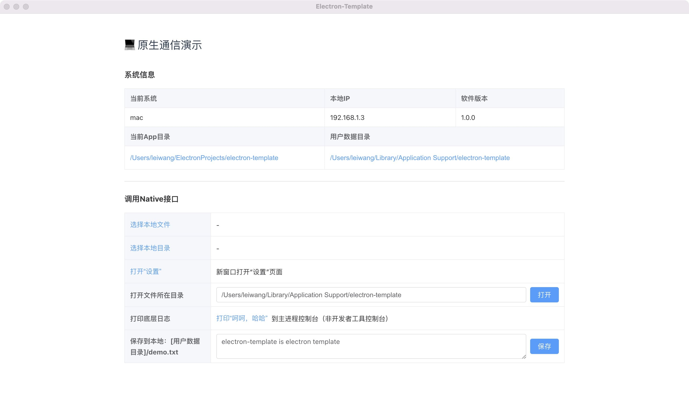
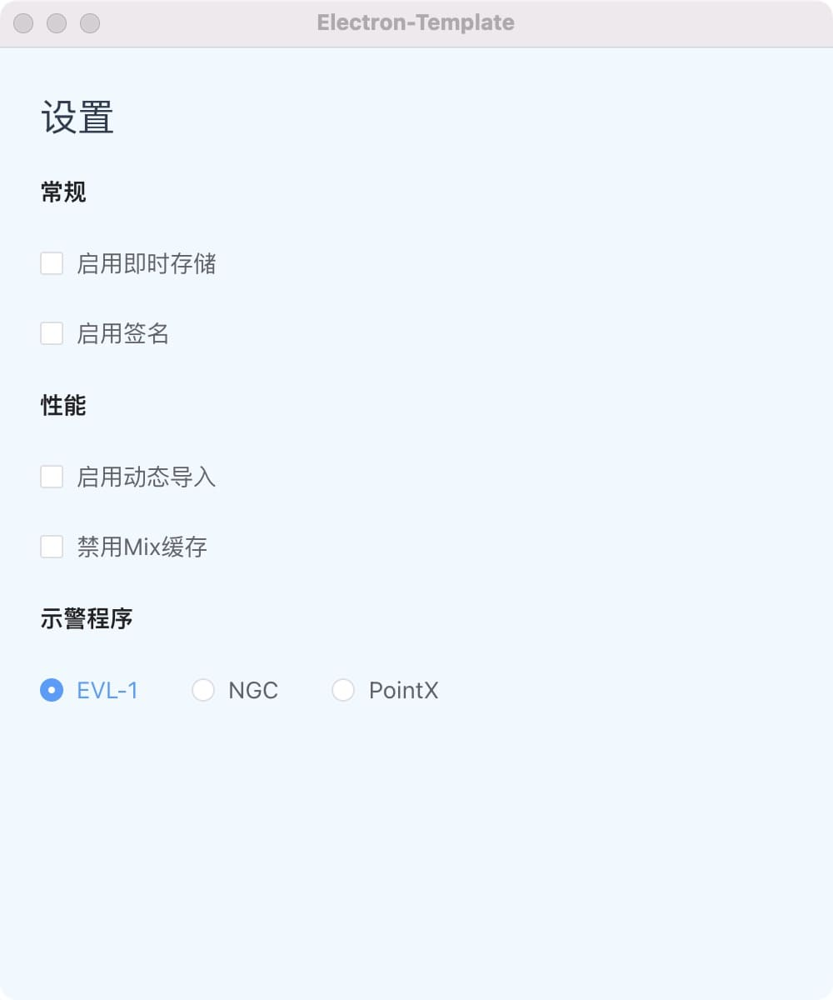

# Electron-Template

使用electron开发桌面端应用的启动模版。这个项目包含了桌面端代码和web端代码，其中桌面端有两个窗口，web端包含两个页面。




## 已包含功能

### 桌面端

- 已包含基础菜单配置：`src/core/appMenu`
- 使用windowManager管理窗口，清晰易用，易配置：`src/WindowManifest`
- 默认包含主窗口和一个设置窗口，满足80%的桌面端场景。
- 支持webUI的本地/远程渲染模式，一键修改：`.env`
- 默认启用沙盒模式，保护程序安全。
- 已封装常用原生api，并导出到web端。

### web端

- 默认包含一个Vue3 + Element Plus的web项目
- 包含了一个首页和一个设置页的基础ui
- 已封装底层原生api，web端可直接引入调用：`@/src/NativeService`

## 代码结构

libs - 存放三方js库

pkg - 打包相关icon资源等

src - 桌面端主要代码

webapps - 存放webUI项目，可以有多个

www - 打包后的webUI代码，程序会加载这个目录下的html

.env - 环境变量

forge.config.js - [forge的配置文件，包括打包、编译插件等](https://www.electronforge.io/)

## 如何使用

### 调试

1. 安装npm包。

```shell
# 桌面端安装npm包
yarn
# web端安装npm包
cd webapps/vue3-webapp && yarn
```

2. 确保`/.env`，启用的是远程渲染模式

```
# 0-远程渲染模式，从baseUrl读取
localRender=0
```

3. 启动webUI。

```shell
yarn webDev
```

4. 打开应用窗口

```shell
yarn start
```

### 打包

1. 确保`/.env`，启用的是本地渲染模式

```
# 1-本地渲染模式，读取/www目录
localRender=1
```

2. 打包webUI到`/www`目录。

```shell
yarn webBuild
```

3. 打包应用程序。（在mac上运行命令打包mac、在windows上运行命令打包windows）

```shell
yarn make
```

## 其他说明

1. 如果不想把webUI打包到桌面应用中，或者UI频繁更新不想每次都打包。可以直接启用远程渲染模式，并修改baseUrl为自己的webUI访问地址。

> 注意这种方式不适合离线应用或者对FCP要求高的，因为远程渲染依赖网络，需要下载资源的时间。常规应用最好是离线加载，实现一键更新功能。

2. 注意主进程和渲染进程是隔离的，主进程和渲染进程通信使用`ipcMain`和`ipcRender`。`preload`脚本运行在渲染进程，并可以访问`Node.js`api。